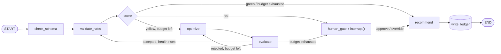

# Quality Guardian

**English** · [Português](README.pt-br.md)


A **stateful LangGraph agent** that validates the data quality of the
[DataOps Knowledge Hub](llamaindex_pydantic_rag/README.md) (W01) and writes the verdict back
to its Ledger. That verdict is the trigger a downstream CrewAI crew (W03) watches for. Built
during my AI Data Engineer specialization.

## Why an explicit state machine?

A ReAct agent decides everything inside one opaque loop: you see the final answer, not the
reasoning. Here the state machine is built **by hand**, so every node, every conditional
edge, and every cycle is code you can point at. Nothing about the decision is hidden.

| Concept | LangGraph mechanism | Where |
|---|---|---|
| Route on red/yellow/green | conditional edge | `route_after_decide` |
| Self-correction (not just retry) | cycle: a cheap model proposes, a strong model judges | `optimize` ⇄ `evaluate` |
| Risky action needs a human | `interrupt()` + `Command(resume=...)` | `human_gate` |
| Survive a crash mid-run | checkpointer, keyed by `thread_id` | `SqliteSaver` |

> **A RED verdict is a risky action, so the agent stops and asks.**
> The graph freezes execution *inside* `human_gate` and hands control back to whoever (or
> whatever) is running it. Days later, in a brand-new process, it resumes from that exact
> point the moment a decision comes in. That's the checkpointer working, not a hack.

## Architecture



Served **four** ways over the exact same graph: CLI, a Python API, an MCP server, and a
Chainlit UI, plus **LangGraph Studio** as a fifth, visual lens. No logic is duplicated
between them.

- **Read (factual):** SQL straight against the W01 Ledger (Postgres), deterministic and with
  no LLM cost, windowed to the N most recent records (the generator never stops; validating
  the whole table would both mask individual red rows in the average and make the state
  unreadable).
- **Write:** `health_score` / `quality_flag` back into `customers`, via SQL. The Hub has no
  write API, so this is the additive part this agent brings.

## Demo

**Auto-correction, for real: the evaluator rejects fabricated fixes twice, then escalates.**
A cheap model proposed a company name; the strong evaluator refused because it was invented,
not verified. Even a YELLOW dataset ends up in `human_gate` once the retry budget is gone,
not just a RED one:

```
[SCORE]      quality_flag: yellow  (health=0.981, n_yellow=2)
[OPTIMIZE]   proposed_fixes: [(980, {'company': 'Vasconcelos', 'failed_orders': 0}), (979, {'company': 'Helena Marques'})]
[EVALUATE]   eval_accepted: no   hardening: 1
             eval_feedback: A correção proposta preenche 'company' com 'Helena Marques' — nome de
                             pessoa física, não de empresa. Não há evidência de que essa seja a
                             empresa correta; é uma inferência inválida, dado falso.
[OPTIMIZE]   proposed_fixes: [(980, {'company': 'Não informado'}), (979, {'company': 'Marques', 'failed_orders': 0})]
[EVALUATE]   eval_accepted: no   hardening: 2   # MAX_RETRIES reached
!! DECISAO NECESSARIA !!
  pergunta: Dataset 'customers' ficou yellow e não foi corrigido após 2 tentativa(s) de
            auto-correção (health=0.981). Aprovar gravação?

$ python -m src.guardian.run resume --thread readme-demo --decision override
[WRITE]      quality_flag: yellow   written: yes
```

**Human-in-the-loop through the Python API**, the same call the MCP server and the UI make:

```python
>>> r = run_guardian(thread_id="api-red")
>>> r.status
'paused'
>>> r.interrupt
{'question': "Dataset 'customers' está RED (health=0.974). Aprovar gravação?",
 'violations': ['email inválido/ausente', 'company nula', ...],
 'options': ['approve', 'override']}

>>> resume_guardian("api-red", decision="override").summary()
"[customers/api-red] CONCLUÍDO — health=0.974, flag=yellow, n_red=2, rows=50"
```

**The same pause, as buttons.** In Chainlit: typed "validar", got a real RED, clicked
Override:

> 🔴 **Dataset 'customers' está RED (health=0.974). Aprovar gravação?**
> **Violações encontradas:** email inválido/ausente · company nula
> `[ ✅ Aprovar (grava RED) ]` `[ ↩️ Override (rebaixa p/ yellow) ]`
>
> *(click Override)*
>
> 🟡 **yellow** — dataset `customers` · health_score: **0.974** · registros validados: 50 · registros red: 2

## Stack

Python · LangGraph · LangChain · langchain-anthropic (Claude) · psycopg · MCP (FastMCP) ·
Chainlit · PostgreSQL · Docker

## Run

```bash
cp .env.example .env                 # add your ANTHROPIC_API_KEY (optional; falls back
                                      # to deterministic heuristics without one)
docker compose up -d postgres        # start the W01 Ledger

pip install -r requirements.txt
pip install -e .                     # registers `guardian` (needed by LangGraph Studio)

python -m src.guardian.run draw      # see the state machine (ASCII + mermaid)
python -m src.guardian.run run       # validate `customers` against the real Ledger
chainlit run chainlit_app.py -w      # or: the conversational UI, at localhost:8000
bash scripts/studio.sh --no-open     # or: LangGraph Studio, at localhost:2024
```
