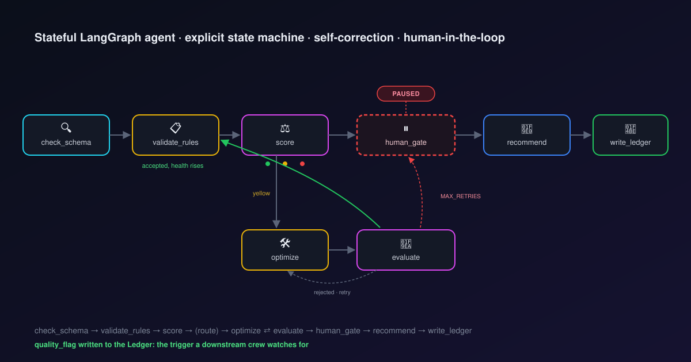
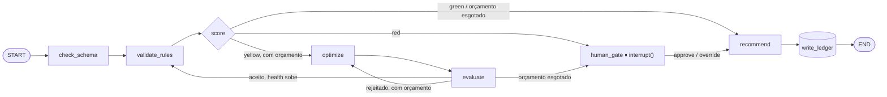

# Quality Guardian

[English](README.md) · **Português**



Um **agente stateful em LangGraph** que valida a qualidade dos dados do
[DataOps Knowledge Hub](llamaindex_pydantic_rag/README.pt-br.md) (W01) e grava o veredito de
volta no Ledger — o gatilho que uma Crew CrewAI (W03) fica de olho pra agir. Construído
durante minha especialização em AI Data Engineer.

## Por que uma máquina de estados explícita?

Um agente ReAct decide tudo dentro de um loop opaco — você vê a resposta final, não o
raciocínio. Aqui a máquina de estados é construída **à mão**: cada nó, cada aresta
condicional, cada ciclo é código que dá pra apontar. Nada da decisão fica escondido.

| Conceito | Mecanismo do LangGraph | Onde |
|---|---|---|
| Rotear por red/yellow/green | aresta condicional | `route_after_decide` |
| Auto-correção (não só repetir) | ciclo — modelo barato propõe, modelo forte julga | `optimize` ⇄ `evaluate` |
| Ação de risco exige humano | `interrupt()` + `Command(resume=...)` | `human_gate` |
| Sobreviver a uma queda no meio da execução | checkpointer, indexado por `thread_id` | `SqliteSaver` |

> **Um veredito RED é uma ação de risco — o agente para e pergunta.**
> O grafo congela a execução **dentro** de `human_gate`, devolve o controle pra quem (ou o
> que) estiver rodando, e — dias depois, num processo totalmente novo — retoma exatamente
> daquele ponto assim que a decisão chega. É o checkpointer funcionando, não um gambiarra.

## Arquitetura



Exposto de **quatro** formas sobre o mesmo grafo — CLI, API Python, servidor MCP, UI Chainlit
— mais o **LangGraph Studio** como uma quinta lente, visual. Nenhuma lógica é duplicada entre
elas.

- **Ler (factual):** SQL direto no Ledger do W01 (Postgres) — determinístico, sem custo de
  LLM, limitado aos N registros mais recentes (o gerador nunca para; validar a tabela inteira
  mascararia reds pontuais na média e deixaria o estado ilegível).
- **Gravar:** `health_score` / `quality_flag` de volta em `customers`, via SQL (o Hub não tem
  API de escrita — essa é a parte aditiva que este agente traz).

## Demonstração

**Auto-correção de verdade — o avaliador rejeitando correções inventadas, duas vezes, e
escalando** (um modelo barato propôs um nome de empresa; o avaliador forte recusou porque era
inventado, não verificado — mesmo um dataset YELLOW acaba no `human_gate` quando o orçamento
de tentativas acaba, não só um RED):

```
[SCORE]      quality_flag: yellow  (health=0.981, n_yellow=2)
[OPTIMIZE]   proposed_fixes: [(980, {'company': 'Vasconcelos', 'failed_orders': 0}), (979, {'company': 'Helena Marques'})]
[EVALUATE]   eval_accepted: no   hardening: 1
             eval_feedback: A correção proposta preenche 'company' com 'Helena Marques' — nome de
                             pessoa física, não de empresa. Não há evidência de que essa seja a
                             empresa correta; é uma inferência inválida, dado falso.
[OPTIMIZE]   proposed_fixes: [(980, {'company': 'Não informado'}), (979, {'company': 'Marques', 'failed_orders': 0})]
[EVALUATE]   eval_accepted: no   hardening: 2   # MAX_RETRIES atingido
!! DECISAO NECESSARIA !!
  pergunta: Dataset 'customers' ficou yellow e não foi corrigido após 2 tentativa(s) de
            auto-correção (health=0.981). Aprovar gravação?

$ python -m src.guardian.run resume --thread readme-demo --decision override
[WRITE]      quality_flag: yellow   written: yes
```

**Human-in-the-loop pela API Python** — a mesma chamada que o servidor MCP e a UI usam:

```python
>>> r = run_guardian(thread_id="api-red")
>>> r.status
'paused'
>>> r.interrupt
{'question': "Dataset 'customers' está RED (health=0.974). Aprovar gravação?",
 'violations': ['email inválido/ausente', 'company nula', ...],
 'options': ['approve', 'override']}

>>> resume_guardian("api-red", decision="override").summary()
"[customers/api-red] CONCLUÍDO — health=0.974, flag=yellow, n_red=2, rows=50"
```

**A mesma pausa, em botões** (Chainlit — digitei "validar", veio um RED de verdade, cliquei Override):

> 🔴 **Dataset 'customers' está RED (health=0.974). Aprovar gravação?**
> **Violações encontradas:** email inválido/ausente · company nula
> `[ ✅ Aprovar (grava RED) ]` `[ ↩️ Override (rebaixa p/ yellow) ]`
>
> → *(clica em Override)* →
>
> 🟡 **yellow** — dataset `customers` · health_score: **0.974** · registros validados: 50 · registros red: 2

## Stack

Python · LangGraph · LangChain · langchain-anthropic (Claude) · psycopg · MCP (FastMCP) ·
Chainlit · PostgreSQL · Docker

## Como rodar

```bash
cp .env.example .env                 # adicione sua ANTHROPIC_API_KEY (opcional — sem ela,
                                      # cai num fallback determinístico)
docker compose up -d postgres        # sobe o Ledger do W01

pip install -r requirements.txt
pip install -e .                     # registra o pacote `guardian` (necessário pro LangGraph Studio)

python -m src.guardian.run draw      # desenha a máquina de estados (ASCII + mermaid)
python -m src.guardian.run run       # valida `customers` contra o Ledger real
chainlit run chainlit_app.py -w      # ou: a UI conversacional, em localhost:8000
bash scripts/studio.sh --no-open     # ou: o LangGraph Studio, em localhost:2024
```
